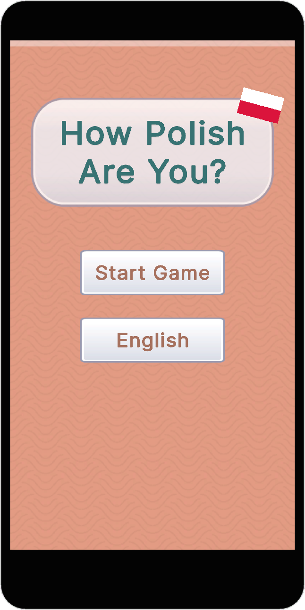
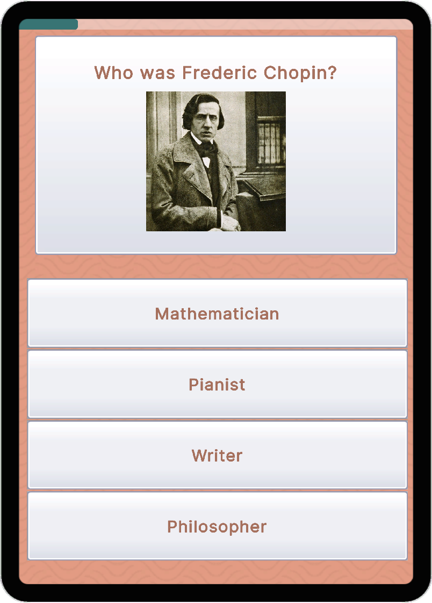
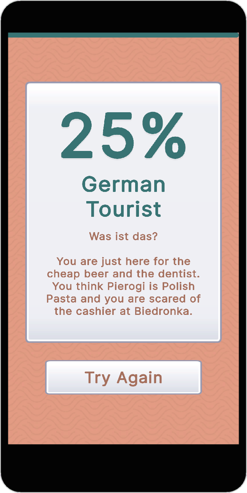
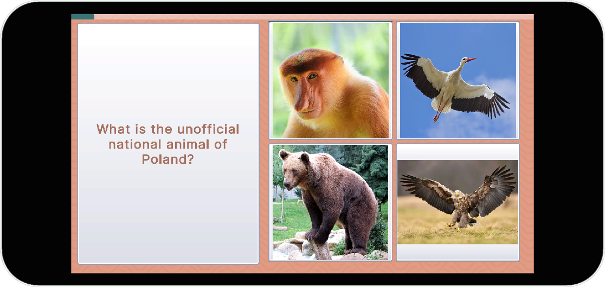

# How X Are You?

A data-driven, expandable quiz game framework built in Unity. Test players' knowledge about any country or topic with localized questions, tiered results, and a charming Boho Matte visual style.


<!-- Add your screenshots here -->
<p align="center">
  
  
  
  
</p>

---

## ✨ Features

- **Multi-Country Support** — Create unlimited country profiles with unique questions, tiers, and localization
- **Randomized Gameplay** — Questions and answers shuffle every playthrough
- **Bilingual** — Toggle between English and native language instantly
- **Tiered Results** — 8 result tiers with unique titles, subtitles, and descriptions
- **Responsive Design** — Supports both Portrait and Landscape orientations
- **Boho Matte Theme** — Warm, inviting visual style with custom assets
- **Google Sheets Integration** — Import data directly from Google Sheets URLs
- **CSV Support** — Alternative local CSV import for offline workflows
- **Dynamic Audio** — Randomized SFX pitch for satisfying feedback

---

## 🎮 Play Now

| Polish 🇵🇱 | Turkish 🇹🇷 |
|:----------:|:----------:|
| [How Polish Are You?](https://bluebuckgames.itch.io/how-polish-are-you) | [How Turkish Are You?](https://bluebuckgames.itch.io/how-turkish-are-you) |
---

## 🚀 Quick Start

### Requirements

- Unity **6.2+** (LTS recommended)
- UI Toolkit (included in Unity)

### Setup

1. **Clone the repository**
   ```bash
   git clone https://github.com/kerem-sirin/how-x-are-you
   ```

2. **Open in Unity**
   - Open Unity Hub
   - Click "Add" → Navigate to cloned folder
   - Open project with Unity 6.2+

3. **Open the main scene**
   ```
   Assets/Scenes/MainGame.unity
   ```

4. **Press Play** : The Polish profile is pre-configured

---

## 📁 Project Structure

```
Assets/
├── Data/
│   └── PL/                      # Country profile folder
│       ├── How X Are You - PL Quiz.csv
│       ├── How X Are You - PL Tier.csv
│       ├── How X Are You - PL UI.csv
│       └── Images/              # Question & answer images
│           ├── Q_00.png         # Question image (ID: 00)
│           ├── Q_01_00.png      # Answer image (Q01, Answer 0)
│           └── Flag.png         # Country flag
│
├── Scripts/
│   ├── Core/
│   │   ├── GameController.cs    # Main game loop & UI
│   │   ├── AudioController.cs   # Music & SFX management
│   │   ├── GameEvents.cs        # Event system
│   │   ├── MediaQuery.cs        # Orientation detection
│   │   ├── MediaQueryEvents.cs  # Orientation events
│   │   └── ResponsiveUI.cs      # Panel/stylesheet swapping
│   ├── Data/
│   │   ├── QuizProfile.cs       # ScriptableObject definition
│   │   ├── QuestionData.cs      # Question structure
│   │   ├── TierData.cs          # Result tier structure
│   │   ├── UIData.cs            # UI strings structure
│   │   └── LocalizedText.cs     # Bilingual text wrapper
│   └── Editor/
│       └── QuizProfileEditor.cs # CSV/Google Sheets import & validation
│
├── UI/
│   ├── Themes/
│   │   ├── BaseTheme.uss        # Main stylesheet
│   │   ├── BaseTheme-Portrait.uss   # Portrait overrides
│   │   └── BaseTheme-Landscape.uss  # Landscape overrides
│   ├── Layouts/
│   │   └── MainGame.uxml        # UI structure
│   └── Textures/                # UI assets (buttons, frames, backgrounds)
│
└── Scenes/
    └── MainGame.unity           # Main scene
```

---

## 📝 Creating a New Country Profile

### Step 1: Create Folder Structure

```
Assets/Data/XX/                  # XX = country code (e.g., DE, JP)
└── Images/
    └── Flag.png
```

### Step 2: Create ScriptableObject

1. Right-click in Project window
2. **Create → HowX → Country Profile**
3. Name it (e.g., `Profile_Poland`)

### Step 3: Configure Profile

| Field | Example | Description |
|-------|---------|-------------|
| Folder Name | `PL` | Must match folder in Assets/Data/ |

### Step 4: Import Data

You can import data from **Google Sheets** (recommended) or **local CSV files**.

#### Option A: Google Sheets Import 🌐

1. Copy the [Google Sheet Template](https://docs.google.com/spreadsheets/d/1ct-ShL0a72dP0yXP25wbkmHo9trunVviVYG2tVhin0E/)
2. Fill in your country's data
3. Make the sheet public (Share → Anyone with link → Viewer)
4. Copy each tab's URL and paste into the profile
5. Click the **Import (Google Sheets)** buttons

#### Option B: CSV Import 📁

1. Export CSVs from Google Sheets
2. Assign CSV files to the profile
3. Click the **Import (CSV)** buttons

### Step 5: Validate

Click **VALIDATE PROFILE** to check for errors.

---

## 📋 Google Sheet Template

> **[📄 View Template on Google Sheets](https://docs.google.com/spreadsheets/d/1ct-ShL0a72dP0yXP25wbkmHo9trunVviVYG2tVhin0E/edit?usp=sharing)**
> 
> This template contains 3 tabs: **Quiz**, **Tier**, and **UI**. You can:
> - 📝 **Comment** on the sheet to suggest improvements
> - 📋 **Make a copy** (File → Make a copy) to create your own country profile
> - 🌐 **Import directly** using tab URLs in Unity

---

## 🖼️ Image Naming Convention

| Type | Pattern | Example |
|------|---------|---------|
| Question Image | `Q_{ID}.png` | `Q_05.png` |
| Answer Image | `Q_{ID}_{AnswerIndex}.png` | `Q_05_00.png`, `Q_05_01.png` |
| Flag | `Flag.png` | `Flag.png` |

- IDs are **zero-padded** to 2 digits: `00`, `01`, `02`...
- Answer indices: `00`, `01`, `02`, `03`

---

## 🎨 Customizing the Theme

The visual style is defined in `Assets/UI/Themes/BaseTheme.uss`:

```css
:root {
    --theme-bg: rgb(231, 158, 133);       /* Terra Cotta */
    --card-bg: rgba(255, 248, 245, 0.95); /* Warm White */
    --theme-accent: rgb(56, 115, 115);    /* Deep Teal */
    --hover-bg: rgb(240, 213, 154);       /* Maize Yellow */
    --text-main: rgb(56, 115, 115);       /* Deep Teal */
    --text-body: rgb(166, 112, 93);       /* Muted Clay */
}
```

Custom assets are in `Assets/UI/Textures/`:
- `Backgrounds/bg_pattern.png` : Tileable background
- `Buttons/button_square_gradient.png` : 9-slice button/panel frame
- `Buttons/button_round_gradient.png` : 9-slice rounded frame

---

## 📱 Responsive Design

The game supports both **Portrait** and **Landscape** orientations:

| Orientation | Layout |
|-------------|--------|
| Portrait | Question on top, answers on bottom |
| Landscape | Question on left, answers on right |

Orientation is detected automatically and the UI adapts via stylesheet swapping.

---

## 🏗️ Building for WebGL

1. **File → Build Settings**
2. Select **WebGL** platform
3. Click **Switch Platform**
4. **Player Settings:**
   - Resolution: **960 x 540**
   - Compression Format: **Brotli** (for itch.io)
   - Memory Size: **256 MB** (adjust if needed)
   - Enable **Decompression Fallback**
5. Click **Build**

### Deploying to itch.io

1. Create a new project on itch.io
2. Set **Kind of project** to **HTML**
3. Upload your WebGL build as a `.zip`
4. Check **This file will be played in the browser**
5. Set viewport dimensions: **960 x 540**
6. Enable **Mobile friendly** and **Fullscreen button**

---

## 🤝 Contributing

Contributions are welcome! See [CONTRIBUTING.md](CONTRIBUTING.md) for detailed guidelines.

### Quick Start for Contributors

1. Fork the repository
2. Create your country folder in `Assets/Data/`
3. Use the [Google Sheet Template](https://docs.google.com/spreadsheets/d/1ct-ShL0a72dP0yXP25wbkmHo9trunVviVYG2tVhin0E/)
4. Import and test with **VALIDATE PROFILE**
5. Submit a Pull Request

### Guidelines

- Follow existing code style
- Test on both Portrait and Landscape orientations
- Ensure all text has both EN and Native translations
- Keep questions family-friendly and culturally respectful

---

## 📄 License

This project is licensed under the **MIT License** : See the [LICENSE](LICENSE) file for details.

---

## 🙏 Acknowledgments

- Built with [Unity UI Toolkit](https://docs.unity3d.com/Manual/UIElements.html)
- Inspired by BuzzFeed-style personality quizzes
- Boho Matte color palette

---

## 🎵 Music Credits

- Music by [Kevin MacLeod](https://incompetech.com)  
- Licensed under [Creative Commons: By Attribution 4.0](http://creativecommons.org/licenses/by/4.0/)

| Track | Usage |
|-------|-------|
| "Cloud Dancer" | Menu Music |
| "Journey To Ascend" | Quiz Music |
| "Sergio's Magic Dustbin" | Result Music |

---

🔊 SFX Credits
- Sound effects by  [Universfield](https://pixabay.com/users/universfield-28281460/) on Pixabay
- Licensed under [Pixabay Content License](https://pixabay.com/service/license-summary/) Content License

| SFX | Usage |
|-------|-------|
| New Notification 07 | Correct Answer |
| Error 04 | Wrong Answer |

---

## 📬 Contact

- **itch.io:** [bluebuckgames](https://bluebuckgames.itch.io)
- **GitHub:** [@kerem-sirin](https://github.com/kerem-sirin)

---

<p align="center">
  Made with ❤️ and way too many pierogi references
</p>
